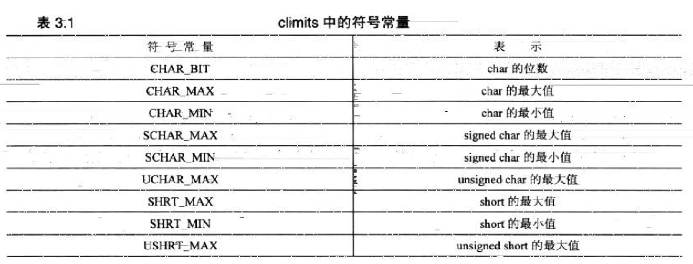
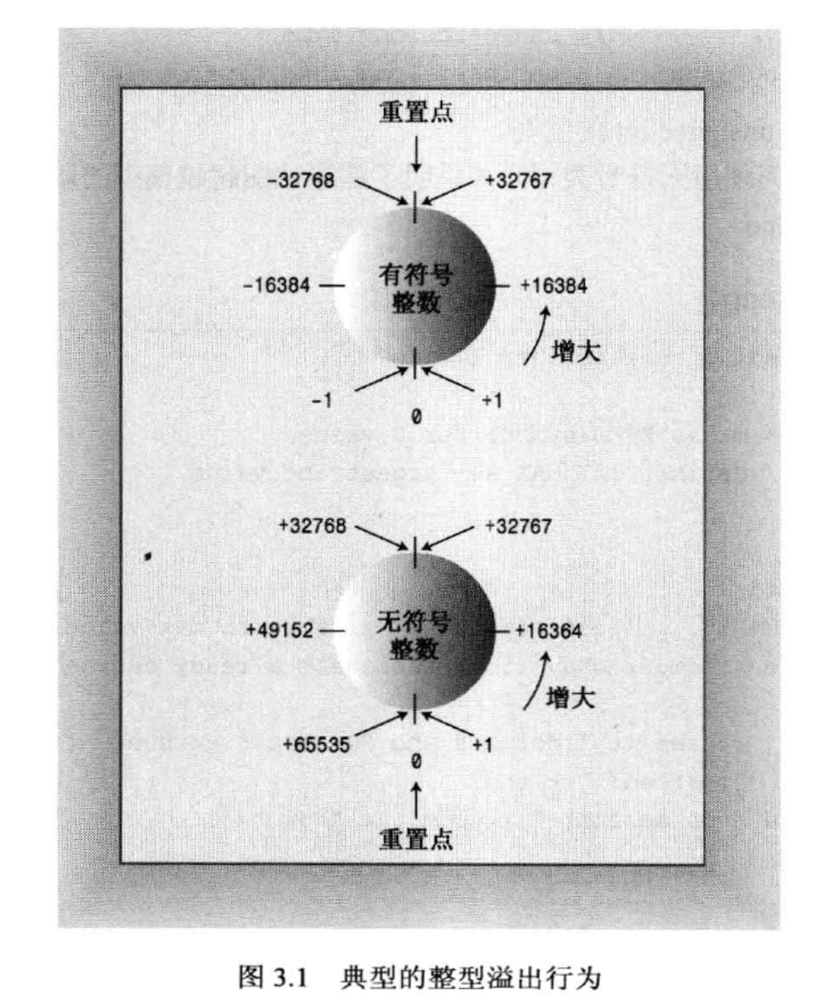
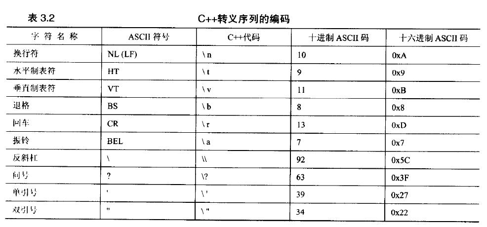

## 第三章 处理数据

### 3.1 简单变量

为把信息存储在计算机中，程序必须记录三个基本属性：

* 信息将存储在哪里
* 要存储什么值
* 存储何种类型的信息

例如：int braincount; braincount = 5; 表明存储的是整数，使用名称braincount表示5的值。
程序找到一块能够存储整数的内存，将该内存单元标记为braincount，将5复制到该内存单元中，我们可以使用braincount来访问该内存单元，若想知道内存单元的地址，可以使用&运算符

#### 3.1.1 变量名

命名规则：

* 只能使用字母字符、数字、下划线
* 名称的第一个字符不能是数字
* 区分大写字符与小写字符
* 不能将c++关键字用作名称
* 以两个下划线或下划线和字母打头的名称被保留给实现（编译器及其使用的资源）使用。以一个下划线开头的名称被保留给实现，用作全局标识符。（虽然命名可能有效，但最好不要使用）
* c++对名称长度没有限制，但有些平台有

**命名方案：可以在变量名中加入其它信息，即描述变量类型或内容的前提。例如n_my_weight为int类型**

#### 3.1.2 整型

整数就是没有小数部分的数字：正数、负数和0

C++中用short、int、long以及long long通过使用不同数目的位来存储，最多能够表示4中不同的整数宽度，不过没有一种选择能够满足所有计算机的设计要求：

* short至少16位
* int至少与short一样长
* long至少32位，且至少与int一样长
* long long至少64位，且至少与long一样长

位与字节：

计算机内存的基本单元是位（bit），8位的内存块可以出现2 * 2 * 2 * 2 * 2 * 2 * 2 * 2 = 256种组合，可以表示0~255或者-128~127。16位单元65536个，32位单元4294672296个值。字节（byte）通常指的是8位的内存单元，字节值得是计算机内存量的度量单位，1KB等于1024字节，1MB等于1024KB。

在头文件climits中包含了关于整型限制的信息

```c++
// 3.1 limits.cpp -- some integer limits
#include<iostream>
#include<climits> // use limits.h for older system
int main()
{
	using namespace std;
	int n_int = INT_MAX; // initialize n_int to max int value
	short n_short = SHRT_MAX; // symbols defined in climits file
	long n_long = LONG_MAX;
	long long n_llong = LLONG_MAX;

	// sizeof operator yields size of type or of variable
	cout << "int is " << sizeof(int) << " bytes." << endl;
	cout << "short is " << sizeof n_short << " bytes." << endl;
	cout << "long is " << sizeof n_long << " bytes." << endl;
	cout << "long long is " << sizeof n_llong << " bytes." << endl;
	cout << endl;

	cout << "Maximum values:" << endl;
	cout << "int: " << n_int << endl;
	cout << "short: " << n_short << endl;
	cout << "long: " << n_long << endl;
	cout << "long long: " << n_llong << endl;

	cout << "Minimum int value = " << INT_MIN << endl;
	cout << "Bits per byte = " << CHAR_BIT << endl;
	return 0;
}
```

程序分析：

1. 可对类型名或变量名使用sizeof运算符，对类型名（int）使用sizeof运算符时，将其放在括号中；对变量名（n_short）使用时，括号可选
2. 头文件climits定义了符号常量来表示类型的限制



.png)

3. #define是一个预处理器编译指令，该指令告诉预处理器：在程序中查找INT_MAX，并将所有的INT_MAX都替换为32767，该指令是C语言遗留下来的，C++可以使用const，不经常使用#define
4. 初始化的几种方法

* int uncles = 5；
* int uncles；uncles=5；
* int uncles(5);// alternative c++ syntax, set uncles to 5
* int uncles = {5};
* int uncles{5};
* int uncles{}; // set uncles to 0

c++可以使用大括号初始化任何类型

#### 3.1.4 无符号类型

```c++
// 3.2 exceed.cpp -- exceeding some integer limits
#include<iostream>
#define ZERO 0 // makes ZERO symbol for 0 value
#include<climits> // define INT_MAX as largest int value
int main()
{
	using namespace std;
	short sam = SHRT_MAX; // initialize a variable to max value
	unsigned short sue = sam; // okay if variable sam already defined

	cout << "Sam has " << sam << " dollars and Sue has " << sue;
	cout << " dollars deposited." << endl
		<< "ADD $1 to each account." << endl << "Now ";
	sam = sam + 1;
	sue = sue + 1;
	cout << "Sam hax " << sam << " dollars and Sue has " << sue;
	cout << " dollars deposited.\nPoor Sam!" << endl;
	sam = ZERO;
	sue = ZERO;
	cout << "Sam has " << sam << " dollars and Sue has " << sue;
	cout << " dollars deposited." << endl;
	cout << "Take $1 from each account." << endl << "Now ";
	sam = sam - 1;
	sue = sue - 1;
	cout << "Sam has " << sam << " dollars and Sue has " << sue;
	cout << " dollars deposited." << endl << "Lucky Sue!" << endl;
	return 0;
}
```

整数型变量的行为就像里程表，如果超越了限制，其值将为范围另一端的取值



#### 3.1.5 选择整形类型

int类型为自然长度，自然长度指的是计算机处理起来效率最高的长度。选择其他类型的情况

* 变量表示不能为负，可以使用无符号类型。
* 如果知道变量可能表示的整数值大于16位整数的最大可能值，使用long，即使系统上int为32位，也应该用long，因为程序被移植到16位系统时，可能无法正常工作。
* 若short比int小，使用short可以节省内存。通常仅当有大型整数数组时，才有必要时用short。
* 如果节省内存很重要，应使用short而不是int，即使他们的长度一样。
* 如果只需要一个字节，使用char。

#### 3.1.6 整型字面值

c++一般有三种基数：十进制、八进制、十六进制

```c++
// 3.3 hexoct1.cpp -- shows hex and octal literals
#include<iostream>
int main()
{
	using namespace std;
	int chest = 42; // decimal integer literal
	int waist = 0x42; // hexadecimal integer literal
	int inseam = 042; // octal integer literal

	cout << "Monsieur cuts a striking figure!\n";
	cout << "chest = " << chest << " (42 in decimal)\n";
	cout << "waist = " << waist << " (0x42 in hex)\n";
	cout << "inseam = " << inseam << " (042 in octal)\n";
	return 0;
}
```

iostream还提供了控制符dec、hex、oct分别用于指示cout以十进制、十六进制、八进制显示整数。c++默认格式为十进制，在修改格式之前，原来格式一直有效。

```c++
// 3.4 hexoct2.cpp -- display values in hex and octal
#include<iostream>
using namespace std;
int main()
{
	int chest = 42;
	int waist = 42;
	int inseam = 42;

	cout << "Monsieur cuts a striking figure!" << endl;
	cout << "chest = " << chest << " (demical for 42)" << endl;
	cout << hex; // manipulator for changing number base
	cout << "waist = " << waist << " (hexadecimal for 42)" << endl;
	cout << oct; // manipulator for changing number base
	cout << "inseam = " << inseam << " (octal for 42)" << endl;
	return 0;
}
```

* cout<< hex；等代码不会在屏幕上显示任何内容，只是修改cout显示整数的方式。他谓语名称空间std中。

#### 3.1.7 C++如何确定常量的类型

C++默认常量类型为int型。特殊情况：使用了特殊的后缀来表示特定的类型（例20L，存储为long类型）、值太大、不能存储为int。

#### 3.1.8 char类型：字符和小整数

char类型是专为存储字符（如字母和数字）而设计的。比short更短

```c++
// 3.5 chartype.cpp -- the char type
#include<iostream>
int main()
{
	using namespace std;
	char ch; // declare a char variable

	cout << "Enter a character: " << endl;
	cin >> ch;
	cout << "Hola!";
	cout << "Thank you for the " << ch << " character." << endl;
	return 0;
}
```

c++对字符使用单引号，对字符串使用双引号。这两者有区别。

```c++
// 3.6 morechar.cpp -- the char type and int type contrasted
#include<iostream>
int main()
{
	using namespace std;
	char ch = 'M'; // assign ASCII code for M to ch
	int i = ch; // store same code in an int 
	cout << "The ASCII code for " << ch << " is " << i << endl;

	cout << "Add one to the character code:" << endl;
	ch = ch + 1; // change character code in ch
	i = ch; // save new character code in i
	cout << "The ASCII code for " << ch << " is " << i << endl;

	// using the cout.put() member function to display a char
	cout << "Displaying char ch using cout.put(ch):";
	cout.put(ch);

	//using cout.put() to display a char constant
	cout.put('!');
	cout << endl << "Done" << endl;
	return 0;
}
```

程序说明：
 
1. cout.put()是一个重要的C++OPP概念――成员函数。类定义了如何表示和控制数据。成员函数归类所有，描述了操纵类数据的方法。类ostream中有一个put()成员函数，用来输出字符。只能通过类的特定对象（例如这里的cout对象）来使用成员函数，必须用句点将对象名和函数名称（put）连接起来，句点被称为成员运算符。
2. char字面值：有些字符不能直接通过键盘输入到程序中，对于这些字符，C++提供了一种特殊的表示方法――转义序列



3. 可以使用基于字符的八进制和十六进制编码来使用转义序列。例如Ctr+Z的ASCII码为26，对应的八进制编码为032，十六进制编码为0x1a。可以使用下面的转义序列来表示该字符：\032或\x1a，将其用单引号括起，可以得到相应的字符常量，也可以放在字符串中，类似于'\n'

```c++
// 3.7 bondini.cpp -- using escape sequences
#include<iostream>
int main()
{
	using namespace std;
	cout << "\aOperation \"HyperHype\" is now activated!\n";
	cout << "Enter your agent code:_______\b\b\b\b\b\b\b";
	long code;
	cin >> code;
	cout << "\aYou entered " << code << "...\n";
	cout << "\aCode verified! Proceed with Plan Z3!\n";
	return 0;
}
```

4. 通用字符名

5. unicode和ISO 10646

6. char在默认情况下既不是没有符号，也不是有符号。

```c++
char fodo; // may be signed, may be unsigned
unsigned char bar; // definitely unsigned
signed char snark; // definitely signed
```

7. wcha_t、char16_t和char32_t

#### 3.1.9 bool类型

bool类型表示真假，C++将非零值解释为true，将零解释为false，任何数字值或指针值都可以被隐式转换（即不用显式强制转换）为bool值，任何非零值都被转换为true，零被转换为false

```c++
bool is_ready = true;
bool not_ready = false;
int ans = true;
int promise = false;
```

### 3.2 CONST限定符

const介绍常量符号，若程序在多个地方使用同一常量，则需要修改该常量时，只需要修改一个符号定义即可。
必须在声明中将其初始化，一般来说：

* const：将首字母大写，例如Months
* #define：将字母全部大写，例如MONTHS
* 其他约定：以字母k大头，kmonths

const比#define的优点：

* 能够明确指定类型
* 作用域还可以用于在特定的函数或文件中
* 可以将const用于更复杂的类型

### 3.3 浮点数

浮点数，即带小数部分的数字。浮点数能够表示小数值、非常大和非常小的值。
例如：d.ddE+n指得是将小数点向右移n位，因为小数点可以移动，所以称为“浮点数”

#### 3.3.1 书写浮点数

1. 常用的标准小数点表示法

* 12.34
* 999.32
* 0.00213
* 8.0

2. E方法：适用于非常大和非常小的数

* 2.52e+8
* 8.33E-4
* 7E5
* -18.32e13

#### 3.3.2 浮点类型

有效位：数字中有意义的位
float至少32位，double至少48位，且不少于float，long double至少和double一样多。者三种类型的有效位数可以一样多

```c++
// 3.8 floatnum.cpp -- floating-point types
#include<iostream>
int main()
{
	using namespace std;
	cout.setf(ios_base::fixed, ios_base::floatfield); // fixed-point
	float tub = 10.0 / 3.0; // good to about 6 places
	double mint = 10.0 / 3.0; // good to about 15 places
	const float million = 1.0e6;

	cout << "tub = " << tub;
	cout << ", a million tubs = " << million * tub;
	cout << ",\nand ten million tubs = ";
	cout << 10 * million * tub << endl;

	cout << "mint = " << mint << " and a million mints = ";
	cout << million * mint << endl;
	return 0;
}

// output
// tub = 3.333333, a million tubs = 3333333.250000,
// and ten million tubs = 33333332.000000
// mint = 3.333333 and a million mints = 3333333.333333
```

程序说明：

1. cout打印6位小数，通常会删除结尾的0，调用cout.setf()会覆盖这种行为。float精度比double低，tub和mint初始化为3.33333333333333.....，由于cout打印6位小数，因此tub和mint都是精确的，当乘一百万后，tub在第七个3之后与正确值有了误差，tub在第7位有效位精确，表示float和double精度不同。

2. 读取包含文件

#### 3.3.3 浮点常量

默认为double类型，如果希望为float类型，加f或F后缀，对于long double类型，加l或L后缀，例如

```c++
1.234f // a float constant
2.45E20F // a float cosntant
2.345324E28 // a double constant
2.2L // a long double constant
```

#### 3.3.4 浮点数的优缺点

优点：可以表示整数之间的值；表示的范围大得多（有缩放因子）
缺点：运算速度慢，精度降低

精度降低的例子

```c++
// 3.9 fltadd.cpp -- precision problems with float
#include<iostream>
int main()
{
	using namespace std;
	float a = 2.34E+22f;
	float b = a + 1.0f;

	cout << "a = " << a << endl;
	cout << "b - a = " << b - a << endl;
	return 0;
}

// output
// a = 2.34e+22
// b - a = 0
```

2.34e+22是一个小数点左边有23位的数字，加上1，就是在第23位+1，但float类型智能表述数字中的前6位或前7位，因此修改第23位对这个值毫无影响

* 整数和浮点型统称算术类型

### 3.4 C++算术运算符

“+、-、*、/、%”，其中取模运算的操作数必须是整型

```c++
// 3.10 arith.cpp -- some C++ arithmetic
#include<iostream>
int main()
{
	using namespace std;
	float hats, heads;

	cout.setf(ios_base::fixed, ios_base::floatfield); // fixed-point
	cout << "Enter a number:";
	cin >> hats;
	cout << "Enter another number:";
	cin >> heads;

	cout << "hats = " << hats << "; heads = " << heads << endl;
	cout << "hats + heads = " << hats + heads << endl;
	cout << "hats - heads = " << hats - heads << endl;
	cout << "hats * heads = " << hats * heads << endl;
	cout << "hats / heads = " << hats / heads << endl;
	return 0;
}
```
#### 3.4.1 运算符的优先级和结合性

加、减优先级相同，乘、除与取模运算优先级相同且高于加减。

#### 3.4.2 除法分支

除法运算符的行为取决于操作数的类型。

* 如果两个操作数都是整数，则执行整数除法，小数部分将被丢弃，最后结果是整数。
* 如果其中有一个（或两个）操作数是浮点值，小数部分将被保留，最后结果是浮点数。

```c++
// 3.11 divide.cpp -- integer and floating-point division
#include<iostream>
int main()
{
	using namespace std;
	cout.setf(ios_base::fixed, ios_base::floatfield);
	cout << "Integer division: 9/5 = " << 9 / 5 << endl;
	cout << "Floating-point division: 9.0/5.0 = ";
	cout << 9.0 / 5.0 << endl;
	cout << "Mixed division: 9.0/5 = " << 9.0 / 5 << endl;
	cout << "double constants: 1e7/9.0 = ";
	cout << 1e7 / 9.0 << endl;
	cout << "float constants: 1e7f/9.0f = ";
	cout << 1.e7f / 9.0f << endl;
	return 0;
}
```

运算符重载简介：int除法、float除法、double除法。C++根据操作数的类型来确定运算符的含义，使用相同的符号进行多种操作叫做运算符重载。

#### 3.4.3 求模运算符

```c++
// 3.12 modulus.cpp -- uses % operator to convert lbs to stone
#include<iostream>
int main()
{
	using namespace std;
	const int Lbs_per_stn = 14;
	int lbs;

	cout << "Enter your weight in pounds: ";
	cin >> lbs;
	int stone = lbs / Lbs_per_stn; // whole stone
	int pounds = lbs % Lbs_per_stn; // remainder in pounds
	cout << lbs << " pounds are " << stone
		<< " stone, " << pounds << " pound(s).\n";
	return 0;
}
```

#### 3.4.4 类型转换

不同类型的计算涉及到的硬件编译指令可能不同，C++自动执行很多类型转换：

* 将一种算术类型的值赋给另一种算术类型的变量时，C++将对值进行转换
* 表达式中包含不同的类型时，C++将对值进行转换
* 将参数传递给函数时，C++将对值进行转换

转换规则：

1. 初始化和赋值进行的转换

C++允许将一种类型的值赋给另一种类型的变量，此时值将被转换为接受变量的类型。将一个值赋给值取值范围更大的类型通常不会导致问题，反之可能会出现问题，潜在的数值转换问题：

* 将较大的浮点类型转换为较小的浮点类型：精度（有效数位）降低，值可能超出目标类型的取值范围，在这种情况下，结果将是不确定的
* 将浮点类型转换为整型：小数部分丢失，原来的值可能超出目标类型的取值范围，在这种情况下，结果将是不确定的
* 将较大的整型转换为较小的整型：原来的值可能超出目标类型的取值范围，通常只复制右边的字节

```c++
// 3.13 init.cpp -- type changes on initialization
#include<iostream>
int main()
{
	using namespace std;
	cout.setf(ios_base::fixed, ios_base::floatfield);
	float tree = 3; // int converted to float
	int guess(3.9832); // double converted to int
	int debt = 7.2E12; // result not defined in C++
	cout << "tree = " << tree << endl;
	cout << "guess = " << guess << endl;
	cout << "debt = " << debt << endl;
	return 0;
}
```

2. 以{}方式初始化时进行的转换

此方式更为严格，列表初始化不允许缩窄，即变量的类型可能无法表示赋给他的值，转换的条件是编译器知道目标变量能够正确地存储赋给它的值

```c++
const int code = 66;
int x = 66;
char c1{31325}; // narrowing, not allowed
char c2 = {66}; // allowed because char can hold 66
char c3{code}; // ditto
char c4 = {x}; // not allowed, x is not constant
x = 31325;
char c5 = x; // allowed by this form of initialization
```

初始化c4时，x值为66，在编译器看来，x是一个变量，其值可能很大，编译器不会跟踪下述阶段可能发生的情况：从x被初始化到他被用来初始化c4

3. 表达式中的转换

当同一个表达式中包含两种不同的算术类型时，执行自动转换。c++将bool、char、unsigned char、signed char和short值转换为int（int为计算机最自然的类型，使用这种类型时，运算速度可能最快），即整型提升。规则确保不会损失数据

* 如果有一个操作数的类型是long double，则将另一个操作数转换为long double
* 否则，如果有一个操作数的类型是double，则将另一个操作数转换为double
* 否则，如果有一个操作数的类型是float，则将另一个操作数转换为float
* 否则，说明操作数都是整型，因此执行整型提升
* 在这种情况下，如果两个操作数都是有符号或无符号的，且其中一个操作数的级别比另一个低，则转换为级别高的类型
* 如果一个操作数为有符号的，另一个操作数为无符号的，且无符号操作数的级别比有符号操作数的级别高，则将有符号操作数转换为无符号操作数所属的类型
* 否则，如果有符号类型可表示无符号类型的所有可能取值，则将无符号操作数转换为有符号操作数所属的类型
* 否则，将两个操作数都转换为有符号类型的无符号版本

4. 传递参数时的转换

5. 强制类型转换

强制类型转换不会修改变量本身，而是创建一个新的、指定类型的值，可以在表达式中使用这个值。

```c++
(typeName) value // converts value to typeName type
typeName (value) // converts value to typeName type
```

其中第一种格式来自C语言，第二种格式是纯粹的C++。新格式的想法是，要让强制类型转换就像是函数调用。
C++还引入了4个强制类型转换运算符，应用更为严格

```c++
static_cast<typeName>(value) // converts value to typeName type
```

```c++
// 3.14 typecast.cpp -- forcing type changes
#include<iostream>
int main()
{
	using namespace std;
	int auks, bats, coots;

	// the following statement adds the values as double,
	// then converts the result to int
	auks = 19.99 + 11.99;

	// these statements add values as int
	bats = (int)19.99 + (int)11.99; // old C syntax
	coots = int(19.99) + int(11.99); // new C++ syntax
	cout << "auks = " << auks << ", bats = " << bats;
	cout << ", coots = " << coots << endl;

	char ch = 'Z';
	cout << "The code for " << ch << " is "; // print as char
	cout << int(ch) << endl; // print as int
	cout << "Yes, the code is "; 
	cout << static_cast<int>(ch) << endl; // using static_cast
	return 0;
}
```

#### 3.4.5 c++11中的auto声明

auto让编译器能够根据初始值的类型推断变量的类型。auto是c语言关键字，但很少使用

```c++
auto x = 0.0; // ok, x is double because 0.0 is double
double y = 0; // ok, 0 is automatically converted to 0.0
auto z = 0; // oops, z is int because is int
```

### 3.5 总结

1. c++基本类型分为两组：整型和浮点型。整型从小到大依次是bool、char、signed char、unsigned char、short、unsigned short、int、unsigned int、long、unsigned long、long long。其中short至少16位，int至少于short一样长，long至少32位，且至少和int一样长。浮点类型可以表示小数值以及比整型能够表示的值大得多的值，三种浮点类型分别是float、double和long double，c++确保float不比double长，而double不比long double长。
2. C++使用算术运算符来提供对数字类型的算术运算：加、减、乘、除和求模。当两个运算符对同一个操作数进行操作时，C++的优先级和结合性规则可以确定先执行哪种操作。
3. 大多数情况下强制类型转换是“安全的”，可以在不损失和改变数据的情况下完成转换。浮点类型转换为整型需要注意。