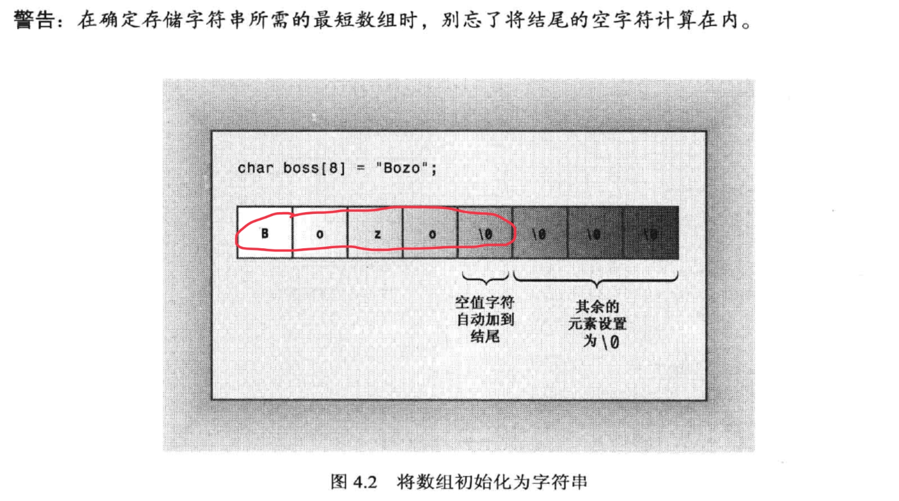
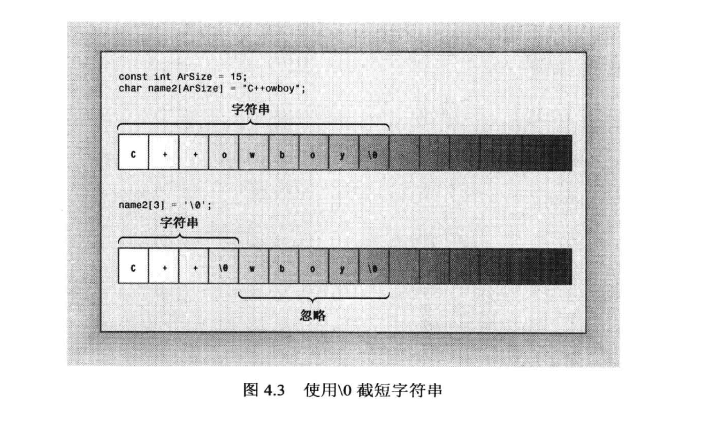
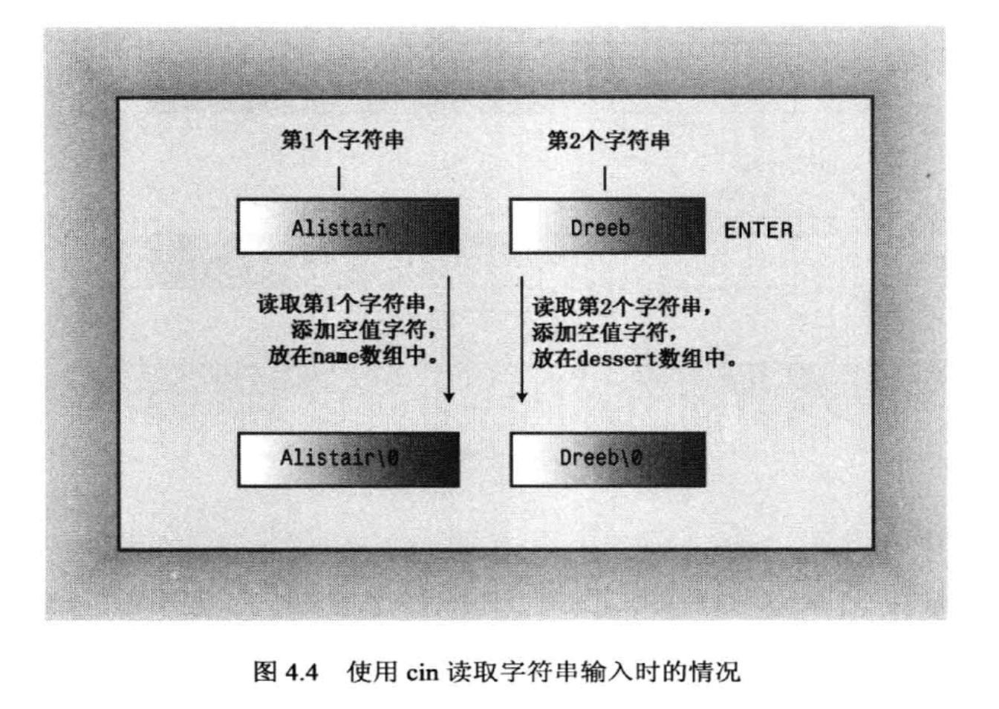
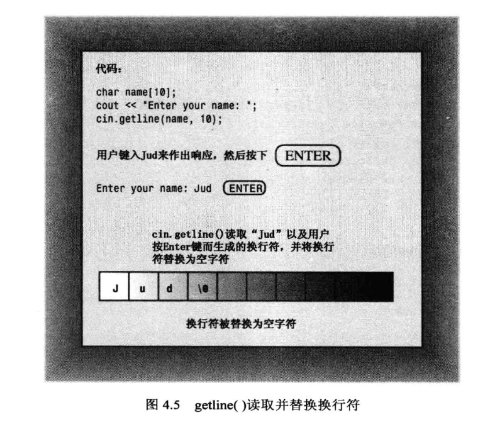
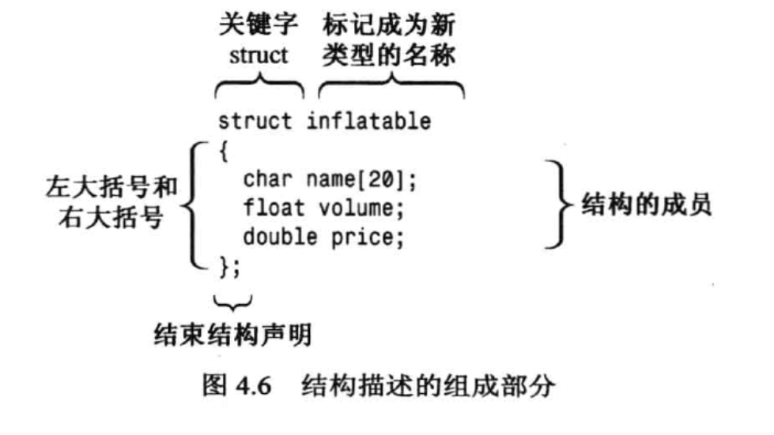
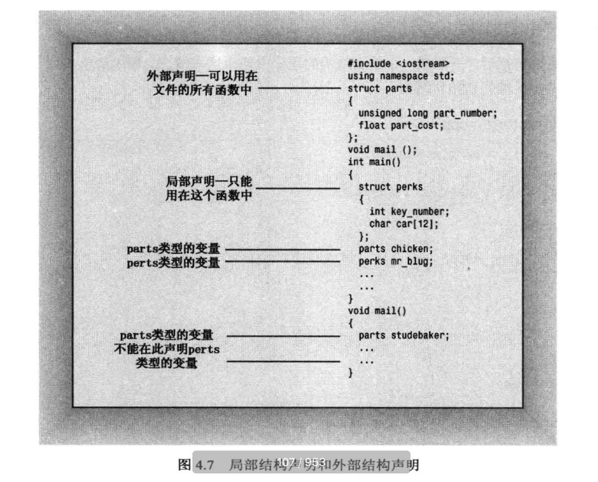
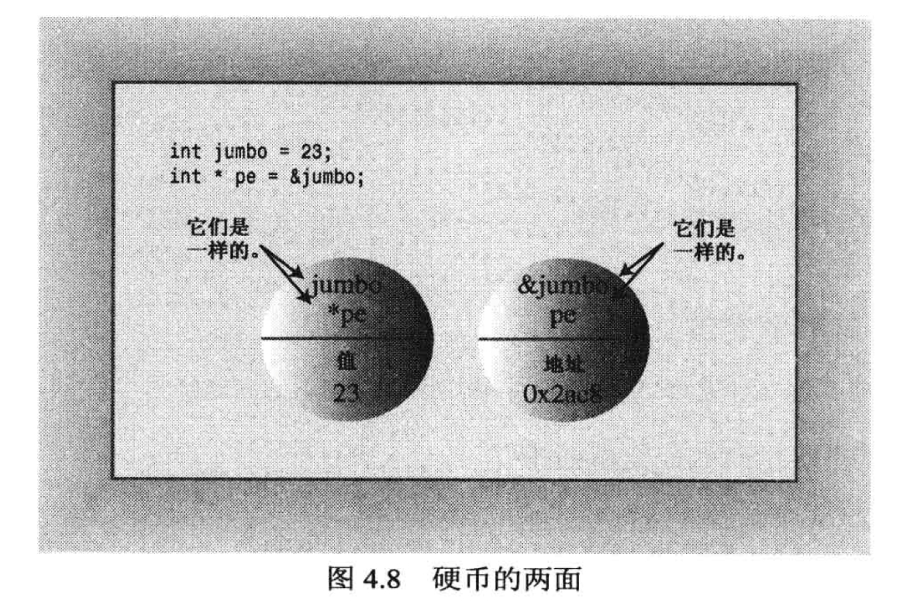
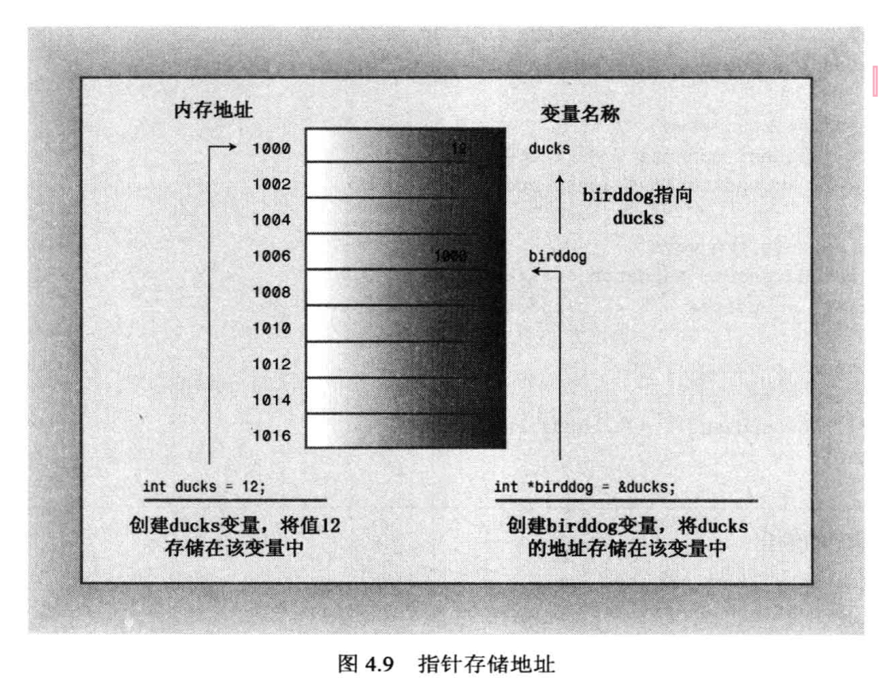
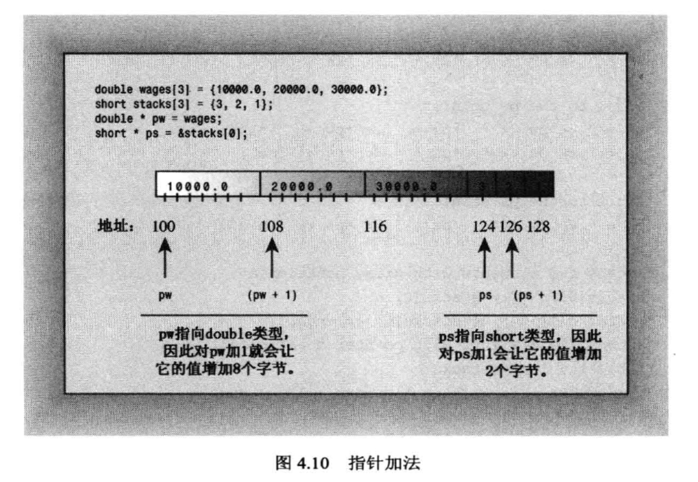
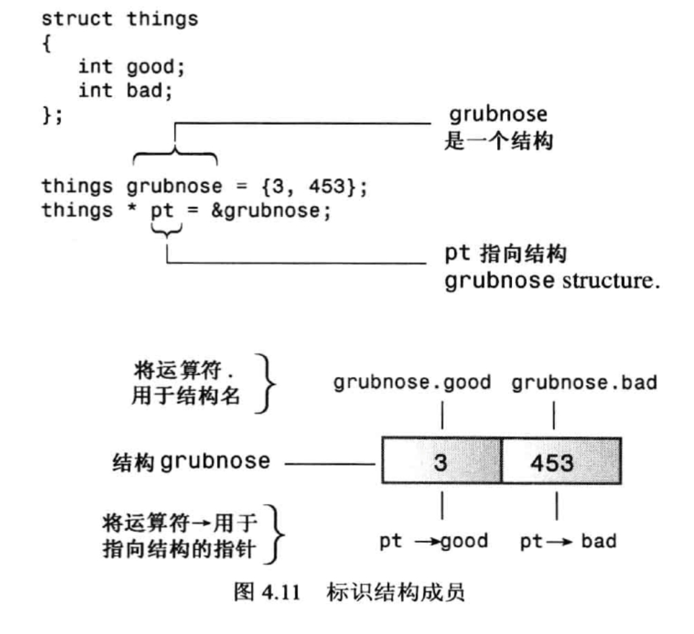

## 第4章 复合类型

### 4.1 数组

数组（array）是一种数据格式，能够存储多个同类型的值，声明数组需要指出以下三点：

* 存储在每个元素中的值的类型
* 数组名
* 数组中的元素数

```c++
typeName arrayName[arraySize];
```

1. 内置类型 如int, char, float, unsigned等。内置类型是最基本的类型。
2. 复合类型 复合类型:使用其它类型定义的类型。有三种复合类型:引用,指针,数组。
3. 类类型 就是类。比如string以及自己定义的类。

不能仅仅将某种东西声明为数组，他必须是特定类型的数组，没有通用的数组类型，但存在很多特定的数组类型。int a[10],a的类型不是“数组”，而是“int数组”，强调了a数组时使用int类型创建的。

索引数组：int a[10];使用下标0-9进行索引，例如a[9]为数组的第十个元素。

* 注意：编译器不会检查使用的下标是否有效，例如讲一个值赋给不存在的元素a[10]或a[11]，编译器不会报错，但程序运行后会发生问题。

```c++
#include<iostream>
using namespace std;
int main()
{
	int yams[3]; // creates array with three elements
	yams[0] = 7;
	yams[1] = 8;
	yams[2] = 6;

	int yamcosts[3] = { 20, 30, 5 }; // create, initialize array
// NOTE: If your C++ compiler or translator can't initialize
// this array, use static int yamcosts[3] instead of 
// int yamcosts[3]

	cout << "Total yams = ";
	cout << yams[0] + yams[1] + yams[2] << endl;
	cout << "The package with " << yams[1] << " yams costs ";
	cout << yamcosts[1] << " cents per yam.\n";
	int total = yams[0] * yamcosts[0] + yams[1] * yamcosts[1];
	total = total + yams[2] * yamcosts[2];
	cout << "The total yam expense is " << total << " cents.\n";

	cout << "\nSize of yams array = " << sizeof yams;
	cout << " bytes.\n";
	cout << "Size of one element = " << sizeof yams[0];
	cout << " bytes.\n";
	return 0;
}
```

#### 4.1.1 程序说明

1. yams包含三个元素，编号为0~2，每个元素都是int。
2. C++允许在声明语句中初始化数组元素：int yamcosts[3] = {20, 30, 5};如果没有初始化，元素值是不确定的，这意味着元素的值为以前驻留在该内存单元中的值。

#### 4.1.2 数组的初始化规则

1. 只能在定义数组时才能初始化，此后就不能使用了，也不能讲一个数组赋给另一个数组，但可以使用下标分别给数组中的元素赋值

```c++
int cards[4] = {3, 6, 8, 10}; // okay
int hand[4]; // okay
float hotelTips[5] = {5.0, 2.5}; // okay, the elements are 5.0 2.5 0 0 0 
short things[] = {1, 5, 3, 8}; // okay, the compiler will count the elements and let array things include 4 elements
hand[4] = {5, 6, 7, 9}; // not allowed
hand = cards; // not allowed
```

2. 让编译器去数数组的大小这个方法并不好，因为计数可能和我们想象的不一样（因为我们可能有遗漏的元素）

```c++
short things[] = {1, 5, 3, 8};
int num_elements = sizeof things / sizeof(short);
```

#### 4.1.3 C++11数组初始化方法

```c++
// 可省略“=”
double earnings[4]{1.2e4, 1.6e4, 1.1e4, 1.7e4}; // okay with C++11

// 可不在大括号内包含任何东西
unsigned int counts[10] = {}; // all elements set to 0
float balances[100] {}; // all elements set to 0

//禁止缩窄转换
long plifs[] = {25, 93, 3.0}; // not allowed
char slifs[4]{'h', 'i', 1122011, '\0'}; // not allowed
char tlifs[4]{'h', 'i', 112, '\0'}; // allowed
```

### 4.2 字符串

字符串是存储在内存的连续字节中的一系列字符，C++处理字符串的方式有两种：

* C语言风格字符串
* string类库

 此处只展示C语言风格字符串，下一节会介绍string类库

 ```c++
 // 下面两行都是char数组，但只有第二个是字符串（第一个字符串没有空字符‘\0’），cout打印数组直到遇到空字符位置
char dog[8] = {'b', 'e', 'a', 'u', 'x', ' ', 'I', 'I'}; // not a string;
char cat[8] = {'f', 'a', 't', 'e', 's', 's', 'a', '\0'}; // a string!

// 下面的两行不需要加入空字符（双引号括起的字符串隐式地包括结尾的空字符），且书写方便。
// 这种字符串被称为字符串常量（string constant）或字符串字面值（string literal）
char bird[11] = "Mr.Cheeps"; // the \0 is understood
char fish[] = "Bubbles"; // let the compiler count
 ```

 

* 注意：字符串常量（使用双引号）不能与字符常量（使用单引号）互换。字符常量（如‘S’）是字符串编码的简写表示。在ASCII系统上，‘S’只是83的另一种写法。但“S”不是字符常量，他表示的是两个字符（S和\0）组成的字符串（“S”实际上表示的是字符串所在的内存地址）。地址在C++中是一种独立的类型，因此C++编译器不允许这种不合理的做法

```c++
char shirt_size = 'S'; // this is fine, shirt_size is assgined by 83
char shirt_size = "S"; // illegal type mismatch
```

#### 4.2.1 拼接字符串常量

任何两个由空白（空格、制表符和换行符）分隔的字符串常量都将自动拼接成一个。
在拼接时不会在被连接的字符串之间添加空格，第二个字符串的第一个字符将紧跟在第一个字符串的最后一个字符（不考虑\0）后面，第一个字符串中的\0字符将被第二个字符串的第一个字符取代。下面语句等效

```c++
cout << "I'd give my right arm to be" " a great violinist.\n";
cout << "I'd give my right arm to be a great violinist.\n";
cout << "I'd give my right ar"
"m to be a great violinist.\n"
```

#### 4.2.2 在数组中使用字符串

将字符串存储到数组中，最常用的方法有两种：将数组初始化为字符串常量；将键盘或文件输入读入到数组中。

```c++
#include<iostream>
#include<cstring>
using namespace std;
int main()
{
	const int Size = 15;
	char name1[Size]; // empty array
	char name2[Size] = "C++owboy"; // initialized array

	// NOTE: some implementations may require the static keyword
	// to initialize the array name2

	cout << "Howdy! I'm " << name2;
	cout << "! What's your name?\n";
	cin >> name1;
	cout << "Well, " << name1 << ", your name has ";
	cout << strlen(name1) << " letters and is stored\n";
	cout << "in an array of " << sizeof(name1) << " bytes.\n";
	cout << "Your initial is " << name1[0] << ".\n";
	name2[3] = '\0'; // set to null character
	cout << "Here are the first 3 characters of my name: ";
	cout << name2 << endl;
	return 0;
}
```

1. sizeof运算符指出整个数组的长度：15字节。
2. strlen函数返回的是存储在数组中字符串的长度，而不是数组本身的长度，且不计算空字符。



#### 4.2.3 字符串输入

```c++
// 4.3 instr1.cpp -- reading more than one string
#include<iostream>
using namespace std;
int main()
{
	const int ArSize = 20;
	char name[ArSize];
	char dessert[ArSize];

	cout << "Enter your name:\n";
	cin >> name;
	cout << "Enter your favorite dessert:\n";
	cin >> dessert;
	cout << "I have some delicious" << dessert;
	cout << " for you, " << name << ".\n";
	return 0;
}

// input: Alistair Dreeb
```

* cin通过空白（空格、制表符和换行符）来确定字符串的结束位置。例如：harry tea只能读取harry，读取完后将该字符串放到数组中，并自动在结尾添加空字符。



#### 4.2.4 每次读取一行字符串输入

istream中的类（如cin）提供了一些面向行(而不是单词)的类成员函数：getline()和get()。这两个函数都读取一行输入，直到到达换行符。

* getline()丢弃换行符，在存储字符串时，用空字符替换换行符
* get()将换行符保留在输入序列中

```c++
// 4.4 instr2.cpp -- reading more than one word with getline
#include<iostream>
using namespace std;
int main()
{
	const int ArSize = 20;
	char name[ArSize];
	char dessert[ArSize];

	cout << "Enter your name:\n";
	cin.getline(name, ArSize); // reads through newline
	cout << "Enter your favorite dessert:\n";
	cin.getline(dessert, ArSize);
	cout << "I have some delicious " << dessert;
	cout << " for you, " << name << ".\n";
	return 0;
}
```



```c++
// 4.5 instr3.cpp -- reading more than one word with get() & get()
#include<iostream>
using namespace std;
int main()
{
	const int ArSize = 20;
	char name[ArSize];
	char dessert[ArSize];

	cout << "Enter your name:\n";
	cin.get(name, ArSize).get(); // read string,newline
	cout << "Enter your favorite dessert:\n";
	cin.get(dessert, ArSize).get();
	cout << "I have some delicious " << dessert;
	cout << " for you, " << name << ".\n";
	return 0;
}
```

1. 于get()不读取并丢弃换行符，如果连续两次调用get，第一次调用后，换行符奖励阻碍输入队列中，因此第二次看到的第一个字符便是换行符。因此get认为已达到行尾，而没有发现任何可读取的内容。如果不借助帮助，get将不能跨过该换行符。

```c++
cin.get(name, ArSize);
cin.get(dessert, ArSize); // a problem
```

2. 可以使用get的变体，不带任何参数的cin.get()调用可读取下一个字符（即使是换行符），因此可以用来处理换行符，为读取下一行输入做好准备。

```c++
cin.get(name, ArSize); // read first line
cin.get(); // read newline
cin.get(dessert, ArSize); // read second line

// also can express: cin.get(name, ArSize).get();
// cin.get(name, ArSize)返回一个cin对象，该对象随后将被用来调用get函数
```

使用get而不是getline的原因：
1. 老式实现没有getline
2. get输入更仔细。假设使用get()将一行读入数组中，如何知道停止读取的原因是由于已经读取了整行，而不是由于数组已经填满呢？查看下一个输入字符，如果是换行符，说明已经读取了整行；否则说明还有其他输入。
3. getline使用起来简单一些，get检查错误更简单一些。可以用其中的任何一个来读取一行输入。

空行和其他问题：
1. 当getline()或get()读取空行时，下一条输入语句将在前一条getline()或get()结束读取的位置开始读取；但当前的做法是，当get()(不是getline())读取空行后将设置失效位。这意味着接下来的输入将被阻断，但可以用cin.clear();来恢复。
2. 若输入字符串比分配的空间长，如果输入行包含的字符数比指定的多，则getline()和get()将把余下的字符留在输入队列中，而getline()还会设置失效位，并关闭后面的输入。


#### 4.2.5 混合输入字符串和数字

混合输入数字和面向行的字符串会导致问题

```c++
// 4.6 numstr.cpp -- following number input with line input
#include<iostream>
int main()
{
	using namespace std;
	cout << "What year was your house built?\n";
	int year;
	cin >> year;
	cout << "What is its street address?\n";
	char address[80];
	cin.getline(address, 80);
	cout << "Year built: " << year << endl;
	cout << "Address: " << address << endl;
	cout << "Done!\n";
	return 0;
}
```

cin读取年份，将回车键生成的换行符留在了输入队列中。后面的cin.getline看到换行符后，会认为是一个空行，将一个空字符串赋给address数组。解决：在读取地址之前先读取并丢弃换行符。
c++常使用指针（而不是数组）来处理字符串，之后会进行介绍。

```c++
// 用get
cin >> year;
cin.get(); // or cin.get(ch);

// 用表达式cin >> year返回cin对象
(cin >> year).get(); // or (cin >> year).get(ch)
```

### 4.3 string类简介

string类位于名称空间std中，必须提供一条using编译指令，或者使用std::string来使用。

```c++
// 4.7 strtype1.cpp -- using the C++ string class
#include<iostream>
#include<string> // make string class available
int main()
{
	using namespace std;
	char charr1[20]; // create an empty array
	char charr2[20] = "jaguar"; // create an initialized array
	string str1; // create an empty string object
	string str2 = "panther"; // create an initialized string

	cout << "Enter a kind of feline: ";
	cin >> charr1;
	cout << "Enter another kind of feline: ";
	cin >> str1; // use cin for input
	cout << charr1 << " " << charr2 << " "
		<< str1 << " " << str2 // use cout for output
		<< endl;
	cout << "The third letter in " << charr2 << " is "
		<< charr2[2] << endl;
	cout << "The third letter in " << str2 << " is "
		<< str2[2] << endl; // use array notation
	
	return 0;
}
```

在很多方面，使用string对象的方式与使用字符数组相同：

* 可以使用C风格字符串来初始化string对象
* 可以使用cin来将键盘输入存储到string对象中
* 可以使用cout来显示string对象
* 可以使用数组表示法来访问存储在string对象中的字符

主要区别：可以将string对象声明为简单变量，而不是数组
类设计让程序能够自动处理string大小。例如创建了一个长度为0的string对象，当输入时自动调整str的长度。与数组相比，使用string对象更方便，也更安全。从理论上说，可以将char数组视为用于存储一个字符串的char存储单元，而string类变量是一个表示字符串的实体。

#### 4.3.1 C++11字符串初始化

可以用列表初始化的方法

```c++
char first_date[] = {"Le Chapon Dodu"};
char second_date[] = {"The Elegant Plate"};
string third_date = {"The Bread Bowl"};
string fourth_date {"Hank's Fine Eats"};
```

#### 4.3.2 赋值、拼接和相加

可以将一个string对象赋给另一个string对象

```c++
char charr1[20]; //create an empty array
char charr2[20] = "jaguar"; // create an initialized array
string str1; // create an empty string object
string str2 = "panther"; // create an initialized string
charr1 = charr2; // INVALID, no array assignment
str1 = str2; // VALID, object assignment ok
```

可以使用运算符+将两个string对象合并，也可以使用运算符+=将字符串附加到string对象的末尾。

```c++
string str3;
str3 = str1 + str2; // assign str3 the joined strings
str1 += str2; // add str2 to the end of str1
```

```c++
// 4.8 strtype2.cpp -- assigning, adding, and appending
#include<iostream>
#include<string> // make string class available
int main()
{
	using namespace std;
	string s1 = "penguin";
	string s2, s3;

	cout << "You can assign one string object to another: s2 = s1\n";
	s2 = s1;
	cout << "s1: " << s1 << ", s2: " << s2 << endl;
	cout << "You can assign a C-style string to a string object.\n";
	cout << "s2 = \"buzzard\"\n";
	s2 = "buzzard";
	cout << "s2: " << s2 << endl;
	cout << "You can concatenate strings: s3 = s1 + s2\n";
	s3 = s1 + s2;
	cout << "s3: " << s3 << endl;
	cout << "You can append strings.\n";
	s1 += s2;
	cout << "s1 += s2 yields s1 = " << s1 << endl;
	s2 += " for a day";
	cout << "s2 += \" for a day\" yields s2 = " << s2 << endl;

	return 0;
}
```

#### 4.3.3 string类的其他操作

c风格的字符串需要使用c语言库中的函数，使用头文件cstring

```c++
// 4.9 strtype3.cpp -- more string class features
#include<iostream>
#include<string> // make string class available
#include<cstring> // C-style string library
int main()
{
	using namespace std;
	char charr1[20];
	char charr2[20] = "jaguar";
	string str1;
	string str2 = "panther";

	// assignment for string objects and character arrays
	str1 = str2; // copy str2 to str1
	strcpy(charr1, charr2); // copy charr2 to charr1

	// appending for string objects and character arrays
	str1 += " paste"; // add paste to end of str1
	strcat(charr1, " juice"); // add juice to end of charr1

	// finding the length of a string object and a C-style string
	int len1 = str1.size(); // obtain length of str1
	int len2 = strlen(charr1);  // obtain length of charr1

	cout << "The string " << str1 << " contains "
		<< len1 << " characters.\n";
	cout << "The string " << charr1 << " contains "
		<< len2 << " characters.\n";
	
	return 0;
}
```

处理string对象的语法比C字符串函数简单，strcat函数使用时可能会出现内存问题

```c++
char site[10] = "house";
strcat(site, " of pancakes"); // memory problem
```

这将覆盖相邻的内存，可以使用strncat或者strncpy，他们接受指出目标数组最大允许长度的的第三个参数，因此更安全，但会增加编写程序的复杂程度。

```c++
int len1 = str1.size(); // obtain length of str1
int len2 = strlen(charr1); // obtain length of charr1
```

上述两句均能返回字符串的字符数，但句法不同：str1不是被用作函数参数，而是位于函数名之前，之间用句点连接，表明str1是一个对象，而size()是一个类方法。方法是一个函数只能通过其所属类的对象进行调用。str1是一个string对象，而size是一个string类的一个方法。

#### 4.3.4 string类I/O

可以使用cin和运算符>>来将输入存储到string对象中，使用cout和运算符<<来显示string对象。
当每次读取一行而不是一个单词时，使用的句法不同。如下程序所示：

```c++
// 4.10 strtype4.cpp -- line input 
#include<iostream>
#include<string> // make string class available
#include<cstring> // C-style string library
int main()
{
	using namespace std;
	char charr[20];
	string str;

	cout << "Length of string in charr before input: "
		<< strlen(charr) << endl;
	cout << "Length of string in str before input: "
		<< str.size() << endl;
	cout << "Enter a line of text:\n";
	cin.getline(charr, 20); // indicate maximum length
	cout << "You entered: " << charr << endl;
	cout << "Enter another line of text:\n";
	getline(cin, str); // cin now an argument; no length specifier
	cout << "You entered: " << str << endl;
	cout << "Length of string in charr after input: "
		<< strlen(charr) << endl;
	cout << "Length of string in str after input: "
		<< str.size() << endl;

	return 0;
}
```

1. charr字符串长度未知，因为未初始化数组的内容视为定义的，其次strlen从数组的第一个元素开始计算字节数，直到空字符。
2. 未初始化的str长度为0
3. cin.getline(charr, 20);句点表明函数getline是istream类的一个类方法：第一个参数是目标数组；第二个参数是数组长度（避免越界）
4. getline(cin, str);没有句点表示，表明getline不是类方法，因为最初的时候istream设计没有处理string的类方法。cin指出到那里查找输入，未指明长度是因为string对象根据字符串的长度自动调整自己的大小。

### 4.4 结构简介

假设要存储有关篮球运动员的ixnxi，则可能需要存储他的姓名、工资、身高、体重、平均得分、命中率、助攻次数等。希望有一种数据格式可以将所有这些信息存储在一个单元中。虽然数组可以存储多个元素，但所有元素的类型必须相同。结构可以存储多种类型的数据，这使得能够将有关篮球运动员的信息放在一个结构中，从而将数据的表示合并在一起。如果要跟踪整个球队，可以使用结构数组。结构也是C++OOP堡垒（类）的基石。

首先定义结构描述――描述并标记了能够存储在结构中的各种数据类型，然后按照描述创建结构变量（结构数据对象）。关键字struct表明这些代码定义的是一个结构的布局，标识符inflatable是这种数据格式的名称，因此这种新类型的名称为inflatable（类似于char，int）。

创建类型变量，由于hat的类型为inflatable，可以使用成员运算符（.）来访问各个成员。例如，hat.volume。访问类成员函数（如cin.getline()）的方式是cognitive访问结构成员变量（如vicent.price）方式衍生出来的

```c++
inflatable hat; // hat is a structure variable of type inflatable
inflatable woopie_cushion; // type inflatable variable 
inflatable mainframe; // type inflatable variable

struct inflatable goose; // keyword struct required in C
inflatable vicent; // keyword struct nore required in C++
```



#### 4.4.1 在程序中使用结构

```c++
// 4.11 structur.cpp -- a simple structure
#include<iostream>
struct inflatable // structure declaration
{
	char name[20];
	float volume;
	double price;
};

int main()
{
	using namespace std;
	inflatable guest =
	{
		"Glorious Gloria", // name value 
		1.88, // volume value
		29.99 // price value
	}; // guest is a structure variable of type inflatable
	// It's initialized to the indicated values
	inflatable pal =
	{
		"Audacious Arthur",
		3.21,
		32.99
	}; // pal is a second variable of type inflatable
	// NOTE: some implementations require using
	// static inflatable guest = 

	cout << "Expand your guest list with " << guest.name;
	cout << " and " << pal.name << "!\n";
	// pal.name is the name member of the pal variable
	cout << "You can have both for $";
	cout << guest.price + pal.price << "!\n";
	return 0;
} 
```
结构声明位置很重要：位于函数外面的声明被称为外部声明，外部声明可以被其后面的任何函数使用，而内部声明只能被该声明所属的函数使用。通常使用外部声明。c++不提倡使用外部变量，但提倡使用外部结构声明。



初始化

```c++
inflatable guest = 
{
	"Glorious Gloria", // name value
	1.88, // volume value
	29.99 // price value
};

infaltable duck = {"Daphne", 0.12, 9.98};
```

#### 4.4.2 C++11结构初始化

1. 可以将列表初始化用于结构，且等号可选
2. 如果大括号内未包含任何东西，各个成员将被设置为0
3. 不允许缩窄变换

```c++
inflatable duck{"Daphne", 0.12, 9.98}; // can omit the = in c++11

inflatable mayor{};
```

#### 4.4.3 结构可以将string类作为成员吗

可以，但要让结构定义能够访问名称空间std，为此，可以将编译指令using移到结构定义之前，或者将name类型声明为std::string

```c++
#include<string>
struct inflatable // structure definition
{
	std::string name;
	float volume;
	double price;
};
```

#### 4.4.4 其他结构属性

可以将结构作为参数传递给函数，也可以让函数返回一个结构。可以使用赋值运算符（=）将结构赋给另一个同类型的结构，这种赋值被称为成员赋值。

```c++
// 4.12 assgn_st.cpp -- assigning structures
#include<iostream>
struct inflatable
{
	char name[20];
	float volume;
	double price;
};
int main()
{
	using namespace std;
	inflatable bouquet =
	{
		"sunflowers",
		0.20,
		12.49
	};
	inflatable choice;
	cout << "bouquet: " << bouquet.name << " for $";
	cout << bouquet.price << endl;

	choice = bouquet; // assign one structure to another
	cout << "choice: " << choice.name << " for $";
	cout << choice.price << endl;
	return 0;
}
```

1. 可以同时完成定义结构和创建结构变量的工作，只需将变量名放在结束括号的后面即可
2. 尽量将结构定义和变量声明分开，是程序易读
3. 可以声明没有名称的结构类型，但是以后无法创建这种类型的变量（不建议使用这种形式）

```c++
// 1
struct perks
{
	int key_number;
	char car[12];
}mr_smith, ms_jones; // two perks variables

// 2
struct perks
{
	int key_number;
	char car[12];
}mr_glitz = 
{
	7, // value for mr_glitz.key_number menber
	"Packard" // value for mr_glitz.car member
};

// 3
struct // no tag
{
	int x; // 2 members
	int y;
}position; // a structure variable
```

#### 4.4.5 结构数组

inflatable结构包含一个数组，也可以创建元素为结构的数组。

```c++
// 4.13 arrstruc.cpp -- an array of structures
#include<iostream>
struct inflatable
{
	char name[20];
	float volume;
	double price;
};
int main()
{
	using namespace std;
	inflatable guests[2] = //initializing an array of structs
	{
		{"Bambi", 0.5, 21.99}, // first structure in array
		{"Godzilla", 2000, 565.99} // next structure in array
	};

	cout << "The guests " << guests[0].name << " and " << guests[1].name
		<< "\nhave a combined volume of "
		<< guests[0].volume + guests[1].volume << " cubic feet.\n";
	return 0;
}
```

#### 4.4.6 结构中的位字段

C++允许指定占用特定位数的结构成员，这使得创建于某个硬件设备上的寄存器对应的数据结构非常方便，字段的类型应为整型或枚举，接下来是冒号，冒号后面是一个数字，指定了使用的位数，可以使用没有名称的字段来提供间距，每个成员都被称为位字段。例如

```c++
struct torgle_register
{
	unsigned int SN: 4; // 4 bits for SN value
	unsigned int: 4; // 4 bits unused
	bool goodIn: 1; // valid input(1 bit)
	bool good Torgle: 1; // successful torgling
}
```

使用通常的方法初始化，使用标准的结构表示法来访问位字段，位字段通常用在低级编程中。

```c++
torgle_register tr = {14, true, false};

if(tr.goodIn) // if statement covered in Chapter 6
```

### 4.5 共用体

共用体是一种数据格式，它能够存储不同的数据类型，但只能同时存储其中的一种类型。由于每次只能存储一个值，因此他必须有足够的空间来存储最大的成员，所以其长度为最大成员的长度。 

```c++
union one4all
{
	int int_val;
	long long_val;
	double double_val;
};
```

共用体的用途之一是：当数据项使用两种或更多种格式（但不会同时使用）时，可节省空间。例如，假设管理一个小商品目录，其中有一些商品的ID为整数，而另一些的ID为字符串。可以这样写：

```c++
struct widget
{
	char brand[20];
	int type;
	union id // format depends on widget type
	{
		long id_num; // type 1 widgets
		char id_char[20]; // other widgets
	}id_val;
};

widget prize;

if(prize.type == 1) // if-else statement
	cin >> prize.id_val.id_num; // use member name to indicate mode
else
	cin >> prize.id_val.id_char;
```

**匿名共用体**
匿名共用体没有名称，其成员将位于相同地址处的变量。

```c++
struct widget
{
	char brand[20];
	int type;
	union // format depends on widget type
	{
		long id_num; // type 1 widgets
		char id_char[20]; // other widgets
	};
};

widget prize;

if(prize.type == 1) // if-else statement
	cin >> prize.id_num; // use member name to indicate mode
else
	cin >> prize.id_char;
```

* 由于共用体是匿名的，因此id_num和id_char被视为prize的两个成员，他们的地址相同，所以不需要中间标识符id_val，程序员负责确定当前哪个成员是活动的。

共用体常用于（但并非只能用于）节省内存。当前，系统的内存多达数GB甚至数TB，好像没有必要节省内存，但并非所有的C++程序都是为了这样的系统编写的。C++还用于嵌入式系统编程，如控制烤箱、MP3播放器或火星漫步者的处理器。对这些应用程序来说，内存可能非常宝贵。另外，共用体常用于操作系统数据结构或硬件数据结构。

### 4.6 枚举

enum提供了另一种创建符号常量的方式，可以代替const，还允许定义新类型，但必须按严格的限制进行。

```c++
enum spectrum{red, orange, yellow, green, blue, violet, indigo, ultraviolet};
```

1. spectrum为新类型的名称，被称为枚举
2. red，orange，yellow为符号常量，对应整数值0~7，叫做枚举量。默认情况下第一个枚举量的值为0，以此类推，也可以显式地指定

用枚举量声明变量

```c++
spectrum band; // band a variable of type spectrum
```

1. 在不进行强制类型转换的情况下，只能将定义枚举时使用的枚举量赋给这种枚举的变量

```c++
band = blue; // valid, blue is an enumerator
band = 2000; // invalid, 2000 not an enumerator
```

2. spectrum变量受到限制，只有8个可能的值。其余值会出现错误，为获得最大限度的可移植性，应将非enum值赋给enum变量视为错误。
3. 枚举只定义了赋值运算符，没有为枚举定义算术运算

```c++
band = orange; // valid
++band; // not valid, ++ discussed in chapter 5
band = orange + red; // not valid, but a little tricky 没有为枚举定义运算符+，但用于算术表达式中时，枚举将被转换为整数，因此表达式orange+red将被转换为1+0，这是一个合法的表达式，但其类型为int，不能将其赋给类型为spectrum的变量band
```

4. 枚举量是整型，可被提升为int类型，但int类型不能自动转换为枚举类型

```c++
int color = blue; // valid, spectrum type promoted to int
band = 3; // invalid, int not converted to spectrum
color = 3 + red; // valid, red converted to int
```

5. 如果对一个不适当的值进行强制类型转换，结果是不确定的，意味着这样做不会出错，但不能依赖得到的结果

```c++
band = spectrum(40003); // undefined
```

枚举的规则十分严格，枚举更常被用来定义相关的符号常量，而不是新类型，例如可以用枚举来定义switch语句中使用的符号常量，如果只打算使用常量而不是创建枚举类型的变量，可以省略枚举类型的名称，例如

```c++
enum {red, orange, yellow, green, blue, violet, indigo, ultraviolet};
```

#### 4.6.1 设置枚举量的值

1. 可以使用赋值运算符来显式地设置枚举量的值

```c++
enum bits{one = 1, two = 2, four = 4, eight = 8};
```

2. 指定的数必须使整数，也可以只显式地定义其中一些枚举量的值，下面例子，first默认为0，未被初始化的枚举量的值将比前面的枚举量大1，因此third的值为101.

```c++
enum bigstep{first, second = 100, third};
```

3. 可以创建多个值相同的枚举量，下面例子，zero和null都为0，one和umero_uno都为1。

```c++
enum{zero, null = 0, one, numero_uno = 1};
```

#### 4.6.2 枚举的取值范围

对于枚举来说，只有声明中指出的那些值是有效的，但是通过强制类型转换，可赋给枚举变量的合法值。例如

```c++
enum bits{one = 1, two = 2, four = 4, eight = 8};
bits myflag;
myflag = bits(6); // valid, because 6 is in bits range
```

枚举范围的定义：
* 上限：需要知道枚举量的最大值，找到大于这个最大值的、最小的2的幂，将它减去1，得到的便是取值范围的上限。
* 下限：需要知道枚举量的最小值，如果他不小于0，则取值范围的下限为0；否则须按照与寻找上限方式相同的方式，但加上负号，例如如果最小的枚举量为-6，而比他小的、最大的2的幂是-8，因此下限为-7。

选择多少空间存储枚举由编译器决定，对于取值范围较小的枚举，使用一个字节或更少的空间；而对于包含long类型值的枚举，使用四个字节。

### 4.7 指针和自由存储空间

指针是一个变量，其存储的是指的地址，而不是值本身。只需对变量应用地址运算符（&）就可以获得他的位置。

```c++
// 4.14 address.cpp -- using the & operator to find addresses
#include<iostream>
int main()
{
	using namespace std;
	int donuts = 6;
	double cups = 4.5;

	cout << "donuts value = " << donuts;
	cout << " and donuts address = " << &donuts << endl;
	// NOTE: you may need to use unsigned (&donuts)
	// and unsigned(&cups)
	cout << "cups value = " << cups;
	cout << " and cups address = " << &cups << endl;
	return 0;
}
```

**指针与C++基本原理**
面向对象编程与传统的过程性编程的区别在于，OOP强调的是在运行阶段（而不是在编译阶段）进行决策。运行阶段指的是程序正在运行时，编译阶段指的是编译器将程序组合起来时。运行阶段决策就好比度假时，选择参观哪些景点取决于天气和当时的心情；而编译阶段决策更像不管在什么条件下，都坚持预先设定的日程安排。运行阶段提供了灵活性，可以根据当时的情况进行调整。例如考虑数组分配内存的情况。传统的方法是声明一个数组。要在C++中声明数组，必须制定数组的长度。因此数组长度在程序编译时就设定好了；这就是编译阶段决策。在80%情况下，一个包含20个元素的数组足够了，但程序有时需要处理200个元素。为了安全起见，使用了一个包含200个元素的数组。这样程序在大多数情况下都浪费了内存。OOP通过将这样的决策推迟到运行阶段运行，使程序更灵活。在程序运行后，可以这次告诉他只需要20个元素，而还可以下次告诉他需要205个元素。总之使用OOP时，可能在运行阶段确定数组的长度。为使用这种方法，语言必须允许在程序运行时创建数组。C++采用的方法是，使用关键字new请求正确数量的内存以及使用指针来跟踪新分配的内存的位置。在运行阶段做决策并非OOP独有的，但使用C++编写这样的代码比使用C语言简单。

处理存储数据的新策略刚好相反，将地址视为指定的量，而将值视为派生量。一种特殊类型的变量――指针用于存储值的地址。因此指针名表示的是地址，*运算符被视为间接值或解除引用运算符，将其应用于指针，可以得到该地址处存储的值（和乘法使用的符号相同，C++根据上下文来确定所指得是乘法还是解除引用）。

```c++
// 4.15 pointer.cpp -- our first pointer variable
#include<iostream>
int main()
{
	using namespace std;
	int updates = 6; // declare a variable
	int *p_updates; // declare pointer to an int
	p_updates = &updates; // assign address of int to pointer

	// express values two ways
	cout << "Values: updates = " << updates;
	cout << ", *p_updates = " << *p_updates << endl;

	// express address two ways
	cout << "Addressses: &updates = " << &updates;
	cout << ", p_updates = " << p_updates << endl;

	// use pointer to change value
	*p_updates = *p_updates + 1;
	cout << "Now updates = " << updates << endl;
	return 0;
}
```

* 变量updates表示值，并使用&运算符来获得地址；变量p_updates表示地址，并使用*运算符来获得值。



#### 4.7.1 声明和初始化指针

指针声明必须指定指针指向的数据的类型，例如：int *p_updates;表明*p_updates的类型为int。由于*运算符被用于指针，因此p_updates变量本身必须是指针。我们说p_updates指向int类型，还说p_updates的类型是指向int的指针，或int*。即p_updates是指针（地址），而*p_updates是int，而不是指针。



* *两边的空格是可选的
* c程序员使用：int *ptr;
* C++程序员使用：int* ptr;
* int*是一种复合类型――指向int的指针，在哪里添加空格没区别，甚至可以不用添加空格
* 如果指针指向两种长度不同的数据类型，但这两种数据类型的地址长度相同。一般来说地址需要2个或4个字节，取决于计算机系统

可以再声明语句中初始化指针，被初始化的是指针，而不是他指向的值。即下面的语句将pt（而不是*pt）的值设为(&higgens)

```c++
int higgens = 5;
int* pt = &higgens;
```

```c++
// 4.6 init_ptr.cpp -- initialize a pointer
#include<iostream>
int main()
{
	using namespace std;
	int higgens = 5;
	int* pt = &higgens;

	cout << "Value of higgens = " << higgens
		<< "; Address of higgens = " << &higgens << endl;
	cout << "Value of *pt = " << *pt
		<< "; Value of pt = " << pt << endl;
	return 0;
}
```

上面程序可知
* 程序将pi（而不是*pi）初始化为higgens的地址

#### 4.7.2 指针的危险

C++在创建指针时，计算机将分配用来存储地址的内存，但不会分配用来存储指针所指向的数据的内存。为数据提供空间是一个独立的步骤。

```c++
long* fellow; // create a pointer-to-long
*fellow = 23333; // place a value in never-never land
```

fellow是一个指针，但代码没有将地址赋给fellow，23333被放在哪不知道。fellow没有被初始化，他可能是任何值，不管是什么，程序都将它解释为存储23333的地址。如果fellow值碰巧为1200，计算机将把数据放在地址1200上，即使这恰巧是程序代码的地址。

* 一定要在指针应用解出引用运算符（*）之前，将指针初始化为一个确定的、适当的地址。

#### 4.7.3 指针和数字

指针不是整型，即使计算机把他当做整数来处理。不能简单的将整数赋给指针（类型不匹配），应通过强制类型转换将数字转换为适当的地址类型

```c++
int* pt;
pt = 0xB8000000; // type mismatch

int* pt;
pt = (int*)0xB8000000; // types now match
```

* pt是int值的地址并不意味着pt本身的类型是int。

#### 4.7.4 使用new来分配内存

前面我们将指针初始化为变量的地址，变量是在编译时分配的有名称的内存，而指针只是为可以通过名称直接访问的内存提供了一个别名。指针的真正用武之地在于，在运行阶段分配未命名的内存以存储值。在这种情况下，只能通过指针来访问内存。

在运行阶段为一个int值分配未命名的内存，并使用指针来访问这个值，使用C++的new运算符，程序员告诉new，需要为那种数据类型分配内存；new将找到一个长度正确的内存块，并返回该内存块的地址，程序员的责任是将该地址赋给一个指针：

```c++
// typeName* pointer_name = new typeName;
// 只能通过*pn来访问变量
int* pn = new int;

// 可以通过higgens和*pt访问变量
int higgens;
int* pt = &higgens;
```

new int告诉程序需要适合存储int的内存，new运算符根据类型来确定需要多少字节的内存，然后找到这样的内存返回其地址，将地址赋给pn，pn被声明为指向int的指针。pn是地址，*pn是存储在pn的值。

```c++
// 4.17 use_new.cpp -- using the new operator 
#include<iostream>
int main()
{
	using namespace std;
	int nights = 1001;
	int* pt = new int; // allocate space for an int
	*pt = 1001; // store a value there

	cout << "nights value = ";
	cout << nights << ": location " << &nights << endl;
	cout << "int ";
	cout << "value = " << *pt << ": location = " << pt << endl;
	double* pd = new double; // allocate space for a double
	*pd = 10000001.0; // store a double there

	cout << "double ";
	cout << "value = " << *pd << ": location = " << pd << endl;
	cout << "location of pointer pd: " << &pd << endl;
	cout << "size of pt = " << sizeof(pt);
	cout << ": size of *pt = " << sizeof(*pt) << endl;
	cout << "size of pd = " << sizeof pd;
	cout << ": size of *pd = " << sizeof(*pd) << endl;
	return 0;
}
```

* 地址本身只指出了对象存储地址的开始，并没有指出其类型（使用的字节数）。指向int的指针的长度和指向double的指针相同，他们都是地址。
* new分配的内存块通常与常规变量声明分配的内存块不同。变量nights和pd的值都存储在被称为栈（stack）的内存区域中，而new从被称为堆（heap）或自由存储区（free store）的内存区分配内存。
* 如果没有足够的空间无法满足new的请求，会引发异常，C++提供了检测并处理内存分配失败的工具。

#### 4.7.5 使用delete释放内存

使用完内存后，需要用delete来将其归还给内存池。使用delete时，后面要加上指向内存块的指针（最初是由new分配的）

```c++
int* ps = new int; // allocate memory with new

// use the memory

delete ps; // free memory with delete when done
```

上面的语句将释放ps指向的内存，但不会删除指针ps本身。例如可以将ps重新指向另一个新分配的内存块，一定要配对的使用new和delete；否则将会发生内存泄漏（memory leak）。也就是说，被分配的内存再也无法使用了。如果内存泄漏严重，程序将由于不断寻找更多的内存而终止。

不要释放已经释放的内存块，这样做的结果是不确定的，意味着什么情况都可能发生，而且不能使用delete释放声明变量所获得的内存。

```c++
int* ps = new int;  // ok
delete ps; // ok
delete ps; // not ok now
int jugs = 5; // ok
int* pi = &jugs; // ok
delete pi; // not allowed, memory not allocated by new
```

* 只能用delete来释放使用new分配的内存。对空指针使用delete是安全的。
* 使用delete的关键在于，将他用于new分配的内存，并不意味着要使用用于new的指针，而是用于new的地址。

一般来说，不要创建两个指向同一个内存块的指针，因为这将增加错误的删除同一个内存块两次的可能性。之后会展示，对于返回指针的函数，使用另一个指针确实有道理。

```c++
int* ps = new int; // allocate memory
int* pq = ps; // set second pointer to same block
delete pq; // delete with second pointer
```

#### 4.7.6 使用new来创建动态数组

如果程序只需要一个值，可能会声明一个简单变量，因为对于管理一个小型数据对象来说，这样做比使用new和指针更简单，对于大型数据（如数组、字符串和结构），应使用new，这正是new的用武之地。如果通过声明来创建数组，则在程序被编译时将它分配内存空间，不管程序最终是否使用数组，数组都在那里占用了内存。在编译时给数组分配内存被称为静态联编，意味着数组是在编译时加入到程序中的。但使用new时，如果在运行阶段需要数组，则创建它；如果不需要则不创建。还可以在程序运行时选择数组的长度，被称为动态联编，意味着数组是在程序运行时创建的，这种数组叫做动态数组。**使用静态联编时，必须在编写程序时指定数组的长度；使用动态联编时，程序将在运行时确定数组的长度。**

1. 使用new创建动态数组

为数组分配内存的通用格式如下：

```c++
// type_name* pointer_name = new type_name[num_elementes]
```

使用new运算符可以确保内存块足以存储num_elements个类型为type_name的元素，而pointer_name将指向第一个元素。可以使用数组名的方式来使用pinter_name

```c++
int* psome = new int[10]; // get a block of 10 ints
delete []psome; // free a  dynamic array

int* pt = new int;
short* ps = new short[500];
delete []pt; // effect is undefined, don't do it
delete ps; // effect is undefined, don't do it
```

new运算符返回第一个元素的地址，上述例子中，该地址被赋给指针psome，方括号告诉程序应该释放整个数组，而不是仅仅是指针指向的元素。如果使用new时不用方括号，则使用delete也不带方括号。如果使用new时使用反馈过好，则使用delete时也应贷方括号。使用new和delete时，应遵循以下规则。
* 不要使用delete来释放不是new分配的内存
* 不要使用delete释放同一个内存块两次
* 如果使用new[]为数组分配内存，则应使用delete []来释放
* 如果使用new[]为一个实体分配内存，则应使用delete（没有方括号）来释放
* 对空指针应用delete是安全的

psome是一个指向一个int（数组第一个元素）的指针。您的责任是跟踪内存块中的元素个数。由于编译器不能对psome是指向10个整数中的第1个这种情况进行跟踪，因此编写程序时，必须让程序跟踪元素的数目。但不能使用sizeof运算符来确定动态分配的数组包含的字节数。

2. 使用动态数组

```c++
// 4.18 arraynew.cpp -- using the new operator for arrays
#include<iostream>
int main()
{
	using namespace std;
	double* p3 = new double[3]; // space for 3 doubles
	p3[0] = 0.2; // treat p3 like an array name
	p3[1] = 0.5;
	p3[2] = 0.8;
	cout << "p3[1] is " << p3[1] << ".\n";
	p3 = p3 + 1; // invrement the pointer
	cout << "Now p3[0] is " << p3[0] << " and ";
	cout << "p3[1] is " << p3[1] << ".\n";
	p3 = p3 - 1; // point back to beginning
	delete []p3; // free the memory
	return 0;
}
```

访问动态数组的元素：由于p3指向数组的第一个元素，因此*p3是第一个元素的值，还有三个元素，只要把指针当做数组名即可访问之后的元素，例如对于第一个元素p3[0]，第二个元素p3[1]，以此类推。
p3=p3+1指出了数组名和指针的根本区别：不能修改数组名的值，但指针是变量，因此可以修改他的值，p3+1之后表达式p3[0]现在指的是数组的第二个值，因此将p3+1导致他指向第二个元素而不是第一个，将他-1后，指针将指向原来的值，这样程序便可以给delete[]提供正确的地址。相邻的int地址通常相差两个或四个字节，而将p3+1后，他将指向下一个元素的地址，这表明指针算术有一些特别的地方。情况确实如此。

### 4.8 指针、数组和指针算术

指针和数组基本等价的原因在于指针算数和C++内部处理数组的方式。整数变量加1后，其值将增加1；但指针变量加1后，增加的量等于他指向的类型的字节数。例如，将指向double的指针加1后，如果系统对double使用8个字节存储，则数值将增加8。

* C++将数组名解释为地址

```c++
// 4.19 addpntrs.cpp -- pointer addition
#include<iostream>
int main()
{
	using namespace std;
	double wages[3] = { 10000.0, 20000.0, 30000.0 };
	short stacks[3] = { 3, 2, 1 };

	// Here are two ways to get the address of an array
	double* pw = wages; // name of an array = address
	short* ps = &stacks[0]; // or use address operator
	//with array element
	cout << "pw = " << pw << ", *pw = " << *pw << endl;
	pw = pw + 1;
	cout << "add 1 to the pw pointer:\n";
	cout << "pw = " << pw << ", *pw = " << *pw << "\n\n";
	cout << "ps = " << ps << ", *ps = " << *ps << endl;
	ps = ps + 1;
	cout << "add 1 to the ps pointer:\n";
	cout << "ps = " << ps << ", *ps = " << *ps << "\n\n";

	cout << "access two elements with array notation\n";
	cout << "stacks[0] = " << stacks[0]
		<< ", stacks[1] = " << stacks[1] << endl;
	cout << "access two elements with pointer notation\n";
	cout << "*stacks = " << *stacks
		<< ", *(stacks + 1) = " << *(stacks + 1) << endl;

	cout << sizeof(wages) << " = size of wages array\n";
	cout << sizeof(pw) << " = size of pw pointer\n";
	return 0;
}
```

#### 4.8.1 程序说明

* double* pw = wages;pw为指向double类型的指针，指向wages数组中的第一个元素的地址
* wages = &wages[0] = address of first element of array



* 指针变量加1后，其增加的值等于指向的类型占用的字节数
* 多数情况下，可以相同的方式使用指针名和数组名。区别是可以修改指针的值，而数组名是常量。

```c++
// arrayname[i] = *(arrayname + i)
// pointername[i] = *(pointername + i)

// pointername = pointername + 1; // valid
// arrayname = arrayname + 1 // not allowed
```

* 对数组应用sizeof运算符得到的数组的长度，而对指针应用sizeof得到的是指针的长度，即使指针指向的是一个数组。

**数组的地址**
对数组取地址时，数组名也不会被解释为其地址。数组名被解释为其第一个元素的地址，而对数组名应用地址运算符时，得到的是整个数组的地址

```c++
short tell[10]; // tell an array of 20 bytes
cout << tell << endl; // displays &tell[0]
cout << &tell << endl; // displays address of whole array
```

从数字上来说，上述两个地址相同；但从概念上来说，&tell[0]（即tell）是一个2字节内存块的地址，而&tell是一个20字节内存块的地址。因此，表达式tell+1将地址值+2，而表达式&tell+2将地址+20。tell是一个short指针（*short），而&tell是一个这样的指针，即指向包含20个元素的short数组（short(*)[20]），初始化

```c++
short (*pas)[20] = &tell; // pas points to array of 20 shorts
```

如果省略括号，优先级规则将使得pas先与[20]结合，导致pas是一个short指针数组，它包含20个元素，因此括号是必不可少的。其次如果描述变量的类型，可将声明中的变量名删除。因此pas的类型为short(*)[20]。 另外，由于pas被设置为&tell，因此*pas与tell等价，所以(*pas)[0]为tell数组的第一个元素。

#### 4.8.2 指针小结

1. 声明指针

```c++
typeName * pointerName;
double * pn; // pn can point to a double value
char * pc; // pc can point to a char value
```

pn和pc都是指针，而double *和char *是指向double的指针和指向char的指针

2. 给指针赋值

应将内存地址赋给指针，可以对变量名应用&运算符来获得被命名的内存的地址，new运算符返回未命名的内存的地址。

```c++
double * pn; // pn can point to a double value
double * pa; // so can pa
char * pc;
double bubble = 3.2;
pn = &bubble; // assign address of bubble to pn
pc = new char; // assign address of newly allocated char memory to pc
pa = new double[30]; // assign address of 1st element of array of 30 double to pa
```

3. 对指针解除引用

对指针解出引用意味着获得指针指向的值，使用运算符(*)来解除引用，也可以使用数组表示法，例如pn[0]与*pn是一样的，绝不要对为被初始化为适当地址的指针解除引用。

```c++
cout << *pn; // print the value of bubble
*pc = 's'; // place 'S' into the memory location whose address is pc
```

4. 区分指针和指针所指向的值

如果pt是指向int的指针，则*pt不是指向int的指针，而是完全等同于一个int类型的变量。pt才是指针

```c++
int * pt = new int; // assigns an address to the pointer pt
*pt = 5; // stores the value 5 at that address
```

5. 数组名

多数情况下C++将数组名视为数组的第一个元素的地址，但运用sizeof运算符用于数组名时，将返回整个数组的长度（单位为字节）

6. 指针算数

C++允许指针和整数相加，加1的结果等于原来的地址值加上指向的对象占用的总字节数，还可以将一个指针减去另一个指针，获得两个指针的差（当且仅当两个指针指向同一个数组，也可以指向超出结尾的一个位置），得到两个元素的间隔

```c++
int tacos[10] = { 5, 2, 8, 4, 1, 2, 2, 4, 6, 8 };
int * pt = tacos; // suppose pf and tacos are the address 3000
pt = pt + 1; // now pt is 3004 if a int is 4 bytes
int *pe = &tacos[9]; // pe is 3036 if an int is 4 bytes
pe = pe - 1; // now pe is 3032, the address of tacos[8]
int diff = pe - pt; // diff is 7, the separation between tacos[8] and tacos[1]
```

7. 数组的动态联编和静态联编

使用数组声明来创建数组时，采用静态联编，数组长度在编译时设置；使用new运算符创建数组时，采用动态联编（动态数组），即将在运行时为数组分配空间，长度也可以在运行时设置，使用完后用delete[]释放占用的内存

```c++
int tacos[10]; // static binding, size fixed at compile time


int size;
cin >> size;
int * pz = new int[size]; // dynamic binding, zsize set at run time
...
delete [] pz; // free memory when finished
```

8. 数组表示法和指针表示法

使用方括号数组表示法等同于对指针解除引用；对于指针和数组名，即可以使用指针表示法，也可以使用数组表示法

```c++
tacos[0] means *tacos means the value at address tacos
tacos[3] means *(tacos+3) means the value at address tacos+3

int * pt = new int[10]; // pt points to block of 10 ints
*pt = 5; // set element number 0 to 5
pt[0] = 6; // reset element number 0 to 6
pt[9] = 44; // set tenth element (element number 9) to 44
int coats[10];
*(coats + 4) = 12; // set coats[4] to 12
```

#### 4.8.3 指针和字符串

```c++
char flower[10] = "rose";
cout << flower << "s are red\n";
```

数组名是第一个元素的地址，因此cout语句中的flower是包含字符r的char元素的地址，给cout提供一个字符的地址，它将从该字符开始打印，直到遇到空字符为止。关键不是flower是数组名，而是一个char的地址，意味着可以将指向char的指针变量作为cout的参数，因为他也是char的地址。“s are red”也是一个地址，C++中用引号括起的字符串像数组名一样，也是第一个元素的地址，即上述代码不会将整个字符串发送给cout，而只是发送该字符串的地址。也就是说，对于数组中的字符串、用括号括起的字符串常量以及指针所描述的字符串，处理方式是一样的，都将传递他们的地址，与逐个传递字符串中的所有字符相比，这样工作量会减少。

* 在cout和多数C++表达式中，char数组名、char指针以及用引用括号括起的字符串常量都被解释为字符串第一个字符的地址。

```c++
// 4.20 ptrstr.cpp -- using pointers to strings
#include<iostream>
#include<cstring> // declare strlen(), strcpy()
int main()
{
	using namespace std;
	char animal[20] = "bear"; // animal holds bear
	const char * bird = "wren"; // bird holds address of string
	char * ps; // uninitialized

	cout << animal << " and "; // display bear
	cout << bird << "\n"; // display wren
	// cout << ps << "\n"; // may display garbage, may cause a crash
	
	cout << "Enter a kind of animal: ";
	cin >> animal; // ok if input < 20 chars
	// cin >> ps; Too horrible a blunder to try; ps doesn't
	// point to allocated space

	ps = animal; // set ps to point to string
	cout << ps << "!\n"; // ok, same as using animal
	cout << "Before using strcpy():\n";
	cout << animal << " at " << (int *)animal << endl;
	cout << ps << " at " << (int *)ps << endl;

	ps = new char[strlen(animal) + 1]; // get new storage
	strcpy(ps, animal); // copy string to new storage
	cout << "After using strcpy():\n";
	cout << animal << " at " << (int *)animal << endl;
	cout << ps << " at " << (int *)ps << endl;
	delete[] ps;
	return 0;
}
```

1. 对于输入，输入能存储在数组中，则使用数组animal来进行输入，用bird进行输入不合适

* 有些编译器将字符串字面值视为只读常量，如果修改将导致编译错误
* 有些编译器只使用字符串字面值的一个副本来表示程序中所有的该该字面值

2. C++不能保证字符串字面值被唯一的存储，如果在程序中多次使用“wren”，编译器可能存储该字符串的多个副本，也可能只存储一个副本。如果是后面一种情况，则将bird设置为指向一个“wren”，将使它只是指向该字符串的唯一一个副本，将值读入一个字符串可能会影响被认为是独立的、位于其他地方的字符串。由于bird指针被声明为const，因此编译器将禁止改变bird指向位置中的内容。
3. 试图将信息读入ps指向的位置更早，由于ps没有被初始化，不知道信息将被存储在哪里，这甚至可能改写内存中的信息。使用足够大的char数组来接受输入即可，不要使用字符串常量或未被初始化的指针来接收输入。为避免这些问题，可以使用string对象，而不是数组。

* 将字符串读入程序时，应使用已分配的内存地址。改地址可以是数组名，也可以是使用new初始化过的指针。

4. 如果给cout提供一个指针，它会打印地址，如果指针的类型为char*，将显示指向的字符串。如果要显示的是字符串的地址，则必须将这种指针强制转换为另一种指针类型，如（int *）。上述将animal赋给ps不会复制字符串，而是复制地址，这样两个指针指向相同的内存单元和字符串。要获得字符串副本，需要分配内存来存储该字符串，可以通过声明另一个数组或者new来完成，后一种方法能根据字符串的长度来指定所需的空间。
5. 将字符串放到数组中，初始化第一个数组时，使用=运算符，第二个使用strcpy或strncpy函数。注意应该使用函数而不是赋值运算符来将字符串赋给数组(string类型除外)。

```c++
char food[20] = "carrots"; // initialization
strcpy(food, "flan"); // otherwise

// 下面代码会出现问题，因为food数组比字符串小
strcpy(food, "a picnic basket filled with many goodies");

// 采用strncpy来解决问题，第三个参数是――要复制的最大字符数
// 如果该函数在到达字符串结尾之前，目标内存已经用完，则他将不会添加空字符，因此需要人为添加；如果该字符串少于19个字符
// 则strncpy()将在复制完该字符串之后加上空字符，以标记该字符串的结尾
strncpy(food, "a picnic basket filled with many goodies", 19);
food[19] = '\0';
```

#### 4.8.4 使用new创建动态结构

分两步：创建结构和访问其成员。

1. inflatable * ps = new inflatable；
2. 访问成员不能用成员运算符句点，因为这种结构没有名称，只知道他的地址，应使用箭头成员运算符（->），可用于指向结构的指针，就像点运算符可用于结构名一样。



* 如果结构标识符是结构名，则使用句点运算符；如果是指向结构的指针，则使用箭头运算符。如果ps是指向结构的指针，则*ps就是被指向的值――结构本身，由于*ps是一个结构，因此可以用(*ps).price来表示该结构的price成员。

```c++
// 4.21 newstrct.cpp
#include<iostream>
struct inflatable // structure definition
{
	char name[20];
	float volume;
	double price;
};
int main()
{
	using namespace std;
	inflatable * ps = new inflatable; // allot memory for structure
	cout << "Enter name of inflatable item: ";
	cin.get(ps->name, 20); // method 1 for member access
	cout << "Enter volume in cubic feet: ";
	cin >> (*ps).volume; // method 2 for member access
	cout << "Enter price: $";
	cin >> ps->price;
	cout << "Name: " << (*ps).name << endl; // method 2
	cout << "Volume: " << ps->volume << " cubic feet\n"; // method1
	cout << "Price: $" << ps->price << endl; // method1
	delete ps; // free memory used by structure
	return 0;
}
```


